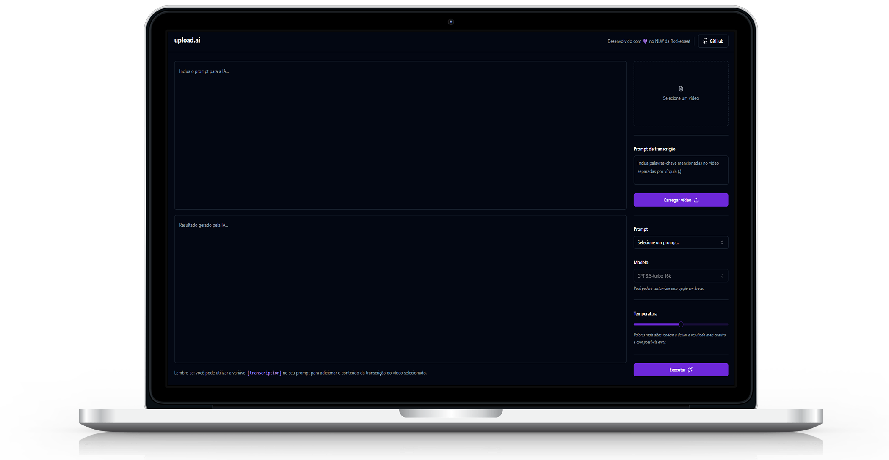

# upload.ai

<h1 align="center">
    
</h1>

## 💻 Sobre o projeto

♻️ upload.ai - é ferramenta que utiliza inteligência artificial para criar títulos e descrições para os seus vídeos.

Projeto desenvolvido durante a **NLW IA - Next Level Week** oferecida pela [Rocketseat](rs).
O NLW é uma experiência online com muito conteúdo prático, desafios e hacks onde o conteúdo fica disponível durante uma semana.

## 🛠 Tecnologias

As seguintes ferramentas foram usadas na construção do projeto:

- [React][reactjs]
- [TypeScript][typescript]
- [Node.js][nodejs]
- [OpenAI][openai]
- [Fastify][fastify]
- [Prisma][prisma]
- [TailwindCSS][tailwind]
- [shadcn/ui][shadcn]

## 🚀 Como executar o projeto

Podemos considerar este projeto como sendo divido em duas partes:
1. Back End (pasta api) 
2. Front End (pasta web)

💡O Front End precisa que o Back End esteja sendo executado para funcionar.

### 📋 Pré-requisitos

Antes de começar, você vai precisar ter instalado em sua máquina as seguintes ferramentas:
[Git](https://git-scm.com), [Node.js][nodejs]. 
Além disto é bom ter um editor para trabalhar com o código como [VSCode][vscode]

### 🎲 Rodando o Back End (servidor)

```bash
# Clone este repositório
$ git clone https://github.com/higorstos/react_upload-ai

# Acesse a pasta do projeto no terminal/cmd
$ cd react_upload-ai

# Vá para a pasta do servidor Back End
$ cd api

# Instale as dependências
$ npm install

# Execute a aplicação em modo de desenvolvimento
$ npm run dev

# O servidor inciará na porta:3333 - acesse http://localhost:3333 
```

### 🧭 Rodando a aplicação web (Front End)

```bash
# Clone este repositório
$ git clone https://github.com/higorstos/react_upload-ai

# Acesse a pasta do projeto no seu terminal/cmd
$ cd react_upload-ai

# Vá para a pasta da aplicação Front End
$ cd web

# Instale as dependências
$ npm install

# Execute a aplicação em modo de desenvolvimento
$ npm run dev

# A aplicação será aberta na porta:3333 - acesse http://localhost:3333
```

---
Feito com ❤️ por Higor Santos 👋🏽 [Entre em contato!](https://www.linkedin.com/in/higorstos/)

[reactjs]: https://reactjs.org
[nodejs]: https://nodejs.org/
[typescript]: https://www.typescriptlang.org/
[vscode]: https://code.visualstudio.com/
[rs]: https://rocketseat.com.br
[shadcn]: https://ui.shadcn.com/
[openai]: https://openai.com/
[fastify]: https://fastify.dev/
[prisma]: https://www.prisma.io/
